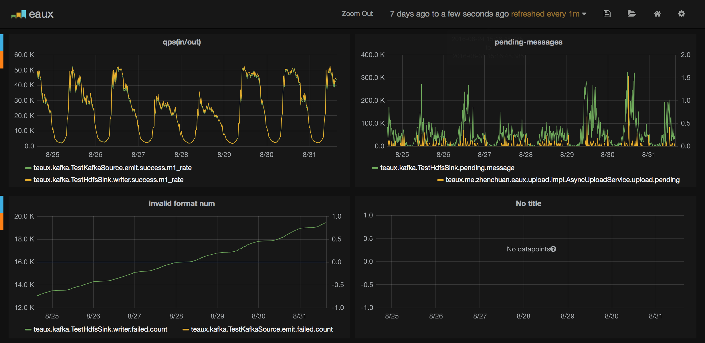

[中文文档](readme.cn.md)
------
the advertisers always need real-time data feedback to optimize their delivery strategy.

firstly,We used `druid.io` a period of time in our test environment, we found some problems

#### hard to dealing with delayed update

This is very common in advertising, such as two-jump / conversion data is often a long delay to click, when you update, you need to perform the entire Reindex, this takes a long time


#### multidimensional data processing in real-time ingest always result in poor result

Advertising logs often need to deal with 60 + dimensions, 20 + metrics data, those data will be aggregated by druid in memory, it can easily lead to GC, resulting message with ZK interruption, which causing a constant Reindex

#### druid does not support sql
sql for most analysts is a better choice

------
After investigating a series of the current popular frameworks (eg: kylin, pinot, druid).  
we found that the popular data warehouse design can actually be summed up with the following

> issue parallel operation to Efficient storage of data on a highly available distributed file system 

things becomes very simple

1. ORC, Parquet is already well implemented in the column storage, no need to implement additional new file format
2. HDFS has been proven a highly available file storage solution 
3. Presto is a very good parallel query engine, doing a lot of query optimization
4. Hive Sql can easily  use `GroupBy` sql clause to do data aggregation, `HadoopIndexer` of druid completely unnecessary;  while hive sql is very flexible, you can create multiple cubes to speed up queries


The problem is redefined 

> issue parallel operation( by *presto*) to Efficient storage of data(by *ORC*) of a highly available distributed file system (by *hdfs*)

what we will to do becomes just generating ORC files to hdfs :-D

Meanwhile, in order to query efficiency,  the aggregation granularity become hourly
```sql
insert overwite my_orc_table partition (pday = 20151201, phour = 4) select a, b, sum (imp), sum (click) from my_orc_table where log_type = 'ic' and pday = 20151201 and phour = 4
```

1. source (kafka) -> orc file -> hdfs
2. crontab for aggregation

Thus, [eaux](https://github.com/zhenchuan/eaux) arises, https://github.com/zhenchuan/eaux

------

### Aims
Eaux's role is read from the data source  and produces a file format ORC  then uploaded to the HDFS ~

Actually, there are several problems to be solved

##### when to generate the ORC files.
`Eaux` generate` ORC` provided in the following configuration file 
```
1. `rotation.period`, PT10m represents a file every 10 minutes to generate. If you need more real-time data, you can consider setting a lower value
2. `rotation.gran`, hour, hour represents the critical point to force generation, for example 12.58 -> 13.00
3. `rotation.file.size.mb`, when the app is configured to use` CommitLog`, if the data size exceeds the set commitLog size, will generate the file.
```

##### generate different ORC files under some special condition

`Eaux` provides` GroupFileWriter` to provide custom logic.


##### Since the `orc file wirter` provided by hive is processed in the memory process, the need to ensure that data is persisted to disk when the program terminates and will not cause data loss

`Eaux` using the` CommitLog` mechanism to ensure the safety of the data is written. If the document fails to generate ORC, it will still be recovered from CommitLog  ~

-----

### Scalability
it 's easy to scale out ,
just copy the generated bin codes to another machine,then run it

###  install to local maven repo
```
mvn install -Dmaven.test.skip
```

## [example](https://github.com/zhenchuan/eaux/tree/master/example)


### hive table

#### `eaux_grouped` 
Using the date field of logs for partition, while advertisers `adv_id% 2 == 0` grouping 

```sql
CREATE  TABLE eaux_grouped(
  day INT ,
  hour INT ,
  id_advertiser_id INT ,
  action_platform STRING ,
  bid_policy_data STRING ,
  bid_rank_data STRING ,
  imp BIGINT ,
  click BIGINT
) partitioned by (pDay int,pHour int,adv int) stored as orc ;
```

#### eaux_plain
Using system date for partition
```sql
CREATE  TABLE eaux_plain(
  day INT ,
  hour INT ,
  id_advertiser_id INT ,
  action_platform STRING ,
  imp BIGINT ,
  click BIGINT
) partitioned by (pDay int,pHour int,adv int) stored as orc ;
```
after create those hive tables,their actural data hdfs path are 
`/apps/hive/warehouse/eaux_grouped`  `/apps/hive/warehouse/eaux_plain` ,

We just need to put  generated orc file to those paths

### code

#### GroupedHdfsSink
generate data for `eaux_grouped` table
```java
//sink configuration
Configuration groupedConfiguration = new PropertiesConfiguration("report.properties");
....
//store local orc file
FileRegistry groupedFileRegistry = new FileRegistry() ;
//group/local/remote file pattern
FileNameGenerator groupedFileNameGenerator = new DateAdvertiserNameGenerator(groupedConfiguration) ;
final RecoverableWriter groupFileWriter = new GroupFileWriter(groupedConfiguration,
                groupedFileRegistry,
                groupedFileNameGenerator);
//recover failed writer               
groupFileWriter.recoverWith(null,null);
//upload file to hdfs
UploadService groupedUploadService = new AsyncUploadService("grouped",groupedFileRegistry,
                groupedFileNameGenerator,groupedConfiguration);
//Sink                
HdfsSink groupedHdfsSink = new GroupedHdfsSink(groupedConfiguration,groupFileWriter,groupedUploadService);
```
[`FileNameGenerator`](https://github.com/zhenchuan/eaux/blob/master/core/src/main/java/me/zhenchuan/eaux/upload/FileNameGenerator.java) interface is used for define the local path and hdfs path.  the grouping method is prefered to  put in its implementation class 

If setting the configuration of `commitlog.enable=true` , the `Group FileWriter` will automatically recover data form commitlog , you do not have to pass additional parameters, so here's arguments are null, `groupFileWriter.recoverWith (null, null)`


#### PlainHdfsSink
genertate data for `eaux_plain` table
```java
//plain sink writer
FileRegistry plainFileRegistry = new FileRegistry() ;
Configuration plainConfiguration = new PropertiesConfiguration("plain.properties");
...
HiveTableFileNameGenerator plainNameGenerator = new PlainNameGenerator(plainConfiguration);
//not using `CommitLog` if left commitLog is null
final RecoverableWriter plainWriter = new FileWriter(plainConfiguration, plainFileRegistry,
                plainNameGenerator,null);  //without commit log
UploadService plainUploadService = new AsyncUploadService("plain",plainFileRegistry,
                plainNameGenerator,plainConfiguration);
HdfsSink plainSink = new PlainHdfsSink(plainConfiguration,plainWriter,plainUploadService) ;
```

Currently support provides `kafka`,` rocketmq`, `file` three data sources, you can also extend [` Source`](https://github.com/zhenchuan/eaux/blob/master/core/src/main/java/me/zhenchuan/eaux/source/Source.java) for your purpose  ~

```java
//kafka source
Configuration inputConfiguration = new PropertiesConfiguration("input.kafka.properties");
final TestKafkaSource kafkaSource = new TestKafkaSource(inputConfiguration);
kafkaSource.via(Lists.newArrayList(groupedHdfsSink,plainSink)).start();
```


### Configuration
#### kafka
key | value
---|---
group.id |  MyConsumerGroup 
zookeeper.connect |192.168.146.69:2181/kafka
zookeeper.session.timeout.ms | 150000
zookeeper.connection.timeout.ms | 120000
auto.offset.reset | largest
consumer.timeout.ms | 60000
socket.receive.buffer.bytes | 1048576
fetch.message.max.bytes | 1048576
consumerTopics | topic:thread_num,eg: imp:2,click:1

#### hdfs sink 
key | value
---|---
name | nrt_orc
work.dir | /tmp/multi/
hdfs.upload | false/true ## upload to hdfs
hdfs.resources | /tmp/core-site.xml,/tmp/hdfs-site.xml
rotation.period | PT5m 
rotation.file.size.mb | 60
rotation.gran | hour/day
writer.parallel | 2
*commitlog.enable | true/false  ##use CommitLog for every `group`
*segment.expiry.check.interval.seconds | 76  ##check interval for `group` data updates periodly
*segment.force.persist.interval.rp | 5   ##force the `group` to generate orc file if no data update after  `5 * 76`

note : `*` for `GroupFileWriter` only

#### graphite 
key | value
---|---
graphite.prefix | eaux144126
graphite.host | 192.168.152.21
graphite.port | 2003
graphite.poll.interval.seconds | 60


#### graphite monitor
single node  

